# Wine Supply Chain
## Contract on Rinkeby
1. Transaction Hash: `0xd7de43101752f8b7804ade656af889ceeefe0dd04ccbe3875f9dedae26beb3f9`
2. Contract address: `0xBA4624e4eaeCBa37F6625e5718d7db8aD27c6E67`

## How to run?
1. Download this project and unzip it.
2. Go to project folder and open Terminal.
3. Install the project dependencies 
    ```bash
    npm install
    ```
4. If you want to run on local machine (optional, continue to 5 if you want to use Rinkeby deployment):
    1. [Download and install Ganache CLI.](https://github.com/trufflesuite/ganache-cli)
    2. Run Ganache CLI and remember the seed phrase.
        ```bash
        ganache-cli
        ```
    3. Deploy the contract on the local network provides by Ganache CLI
        ```bash
        truffle deploy --network development_cli
        ```
    4. Restore accounts in Metamask using the seed phrase of the Ganache CLI.
    You will need at least two accounts: one is for farm/grape/bottle owner, and 
    another one is for bottle buyer.
5. Run the server, that will serve the contract front-end to your browser.
    ```bash
    node index.js
    ```
7. Open `localhost:8080/index.html` in your browser.
8. Do not forget to switch accounts in Metamask, while acting on behalf of the
buyer

## How to run automated test locally?
1. Make sure, you have done (1), (2), (3) of this README
2. Make sure, you have done (4.1), (4.2) of this README
3. In project folder open the Terminal and: 
    1. Run tests for Farm:
        ```bash
        truffle test test/FarmTest.js
        ```
    2. Run tests for Grape:
        ```bash
        truffle test test/GrapeTest.js
        ```
    3. Run tests for Bottle:
        ```bash
        truffle test test/BottleTest.js
        ```
> __IMPORTANT!__ Please, run the tests individually, as described
above. If you execute `truffle test`, then tests for the Grape will
start failing for the unknown reason.
## What User can do?
### Anybody
#### Register the new Farm
Anybody can register the new farm with a few details
about it.
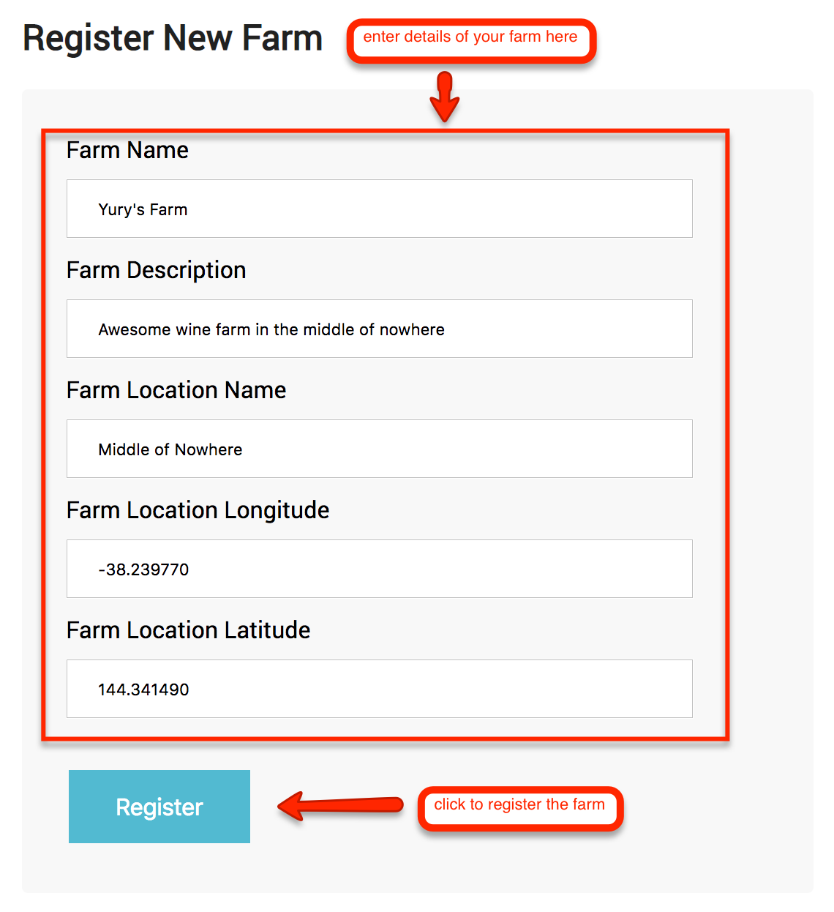
#### Get the Farm details
Anybody can find the details of the farm by its id.
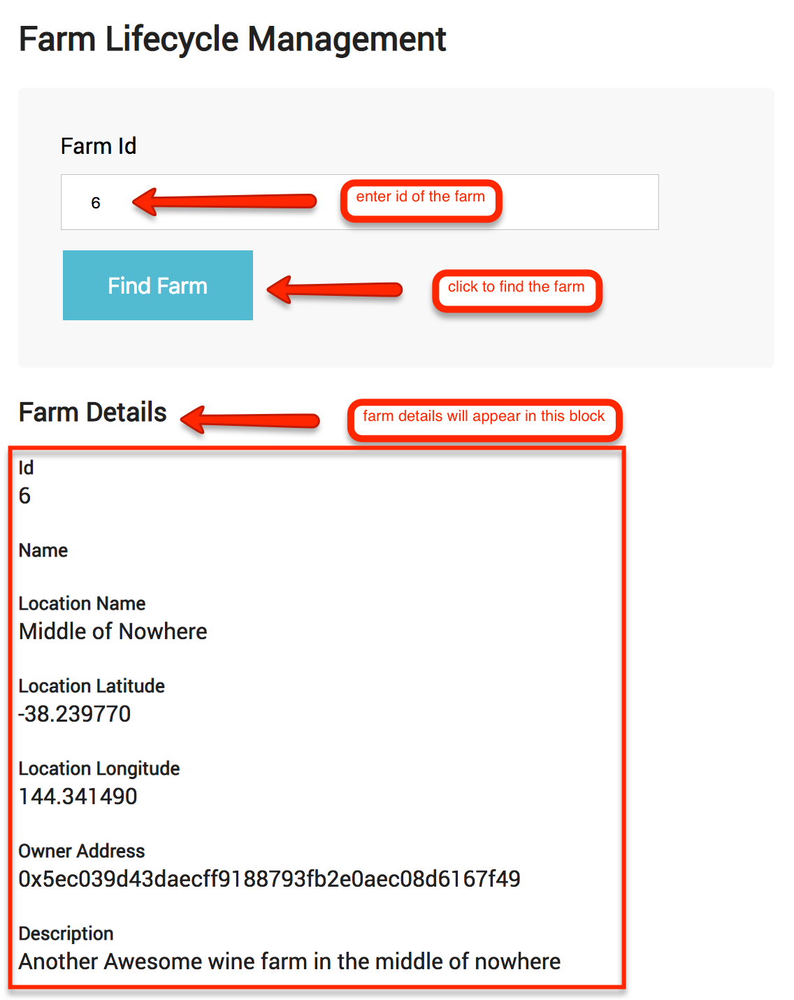
#### Get the Grape details
Anybody can find the details of the Grape by its id.
It will also give back the details of the Farm, where
the Grape had been harvested.
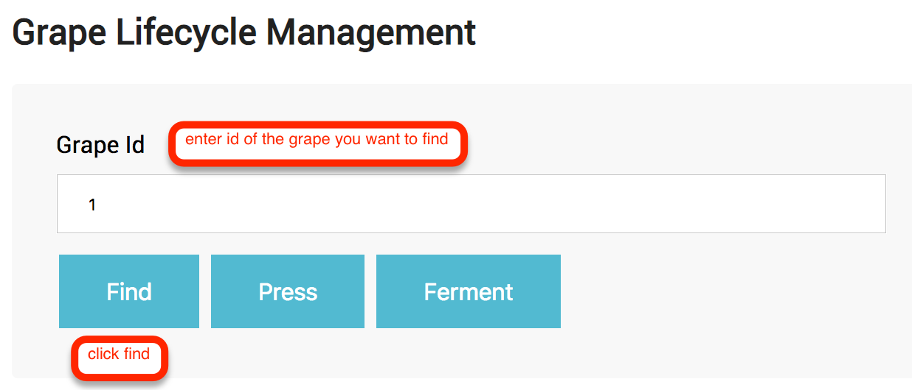


#### Get the Bottle details
Anybody can get the details of the Bottle by its UPC.
It will also give back the details of the Grape, that
was used to produce the bottle. And the details of the 
Farm, where the Grape had been harvested.
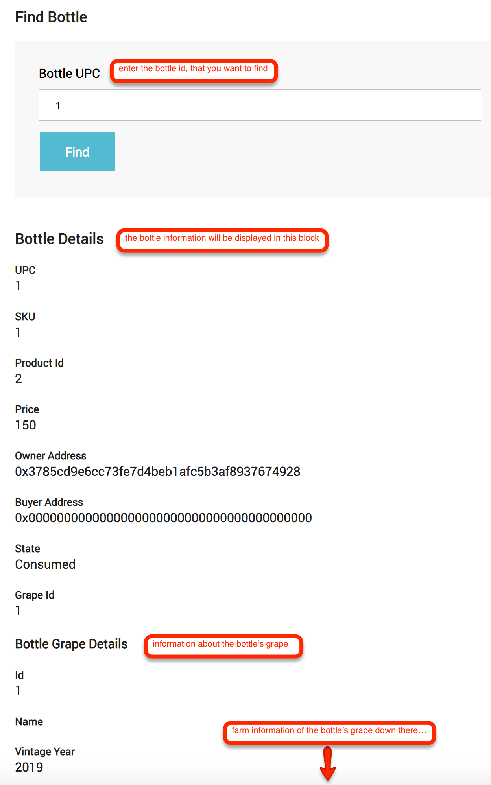
### Farm/Grape Owner
#### Harvest the new Grape
The farm owner can harvest the Grape from the farm he/she owns.
Farm owner becomes the owner of the harvested Grape.
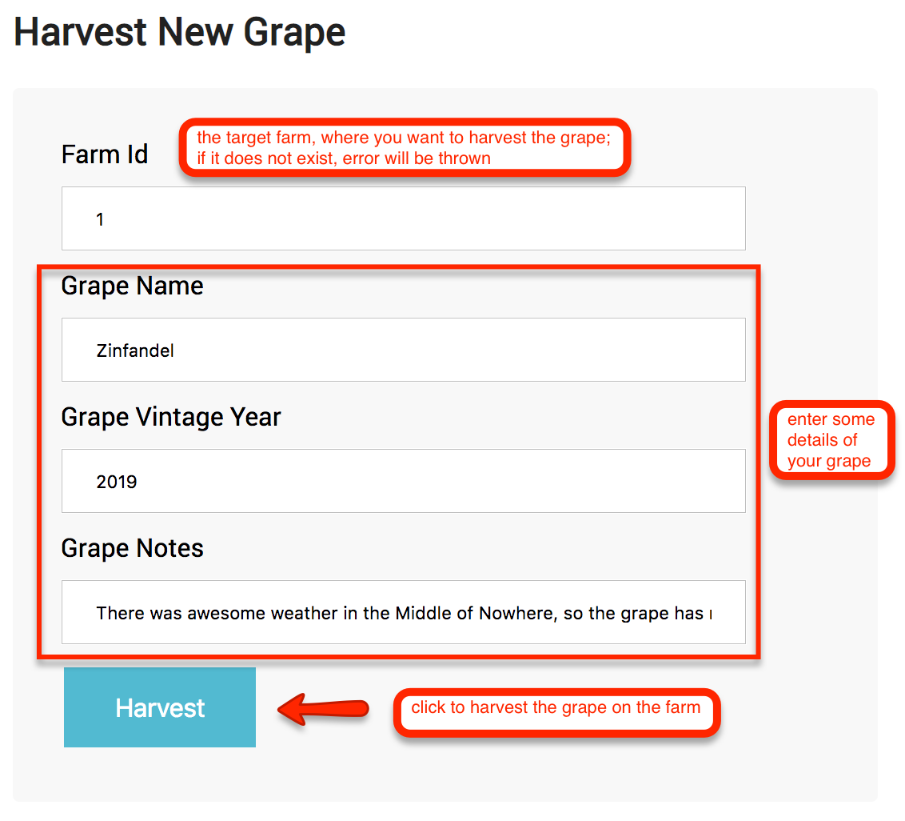
#### Press the Grape
After the Grape is harvested, the owner of the Grape
can press it.
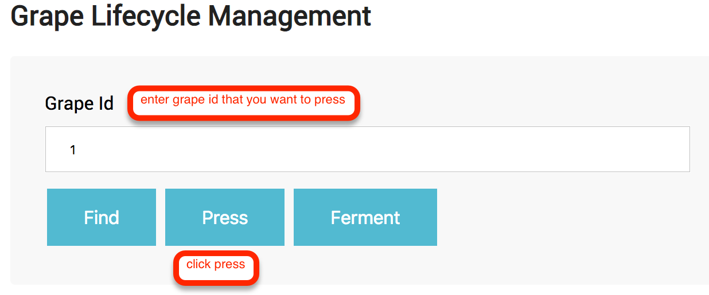
#### Ferment the Grape
After the Grape is pressed, the owner can ferment it.
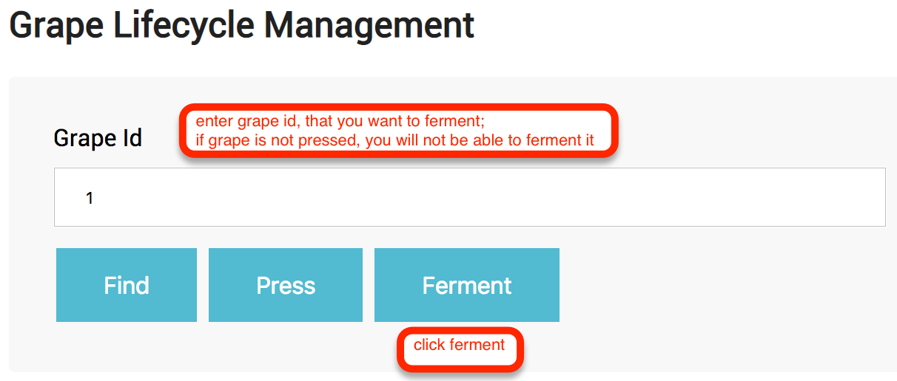
#### Create the Bottle
When the Grape is fermented, the owner can start
creating bottles from it.
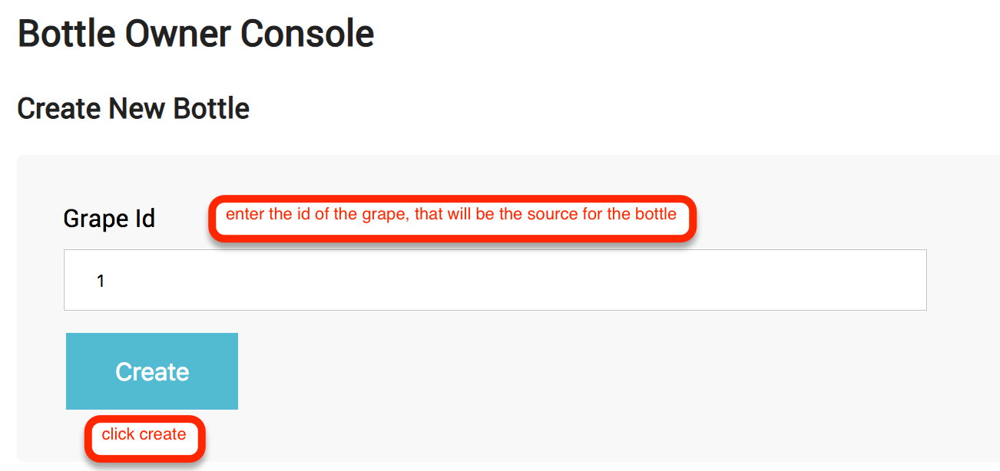
### Any Bottle Owner
#### Add the Bottle for Sale
Once the bottle is created, or received by the new
owner, then the new owner can add it for sale.
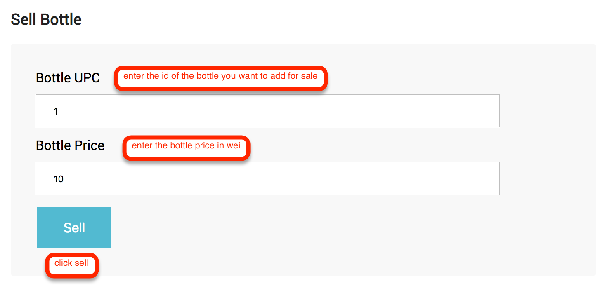
#### Ship the Bottle or Consume it
When the Bottle is sold to the buyer, the bottle
owner can ship it to the buyer.
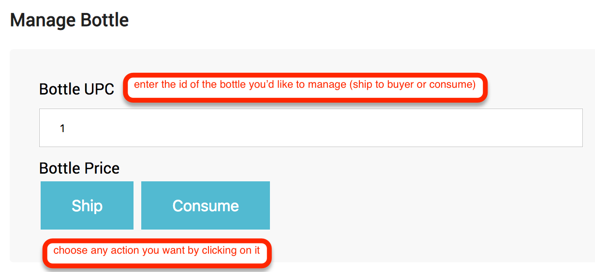
### Any Bottle Buyer
#### Buy the Bottle
When the Bottle is for sale, anybody else, except the 
owner of the bottle, can buy it.
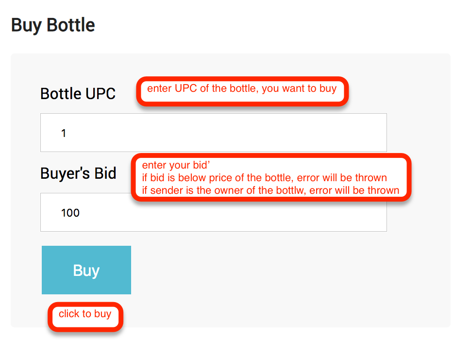
#### Receive the Bottle
When the bottle has been shipped to the buyer,
buyer can confirm the shipment by receiving the bottle.
> __IMPORTANT!__ After this action, the buyer becomes the owner of the bottle.
It means, he can perform the actions of the owner: add the bottle for sale, or 
consume the bottle. It makes the number of hops in the supply chain indefinite and 
no code shall be added to support a new hop.

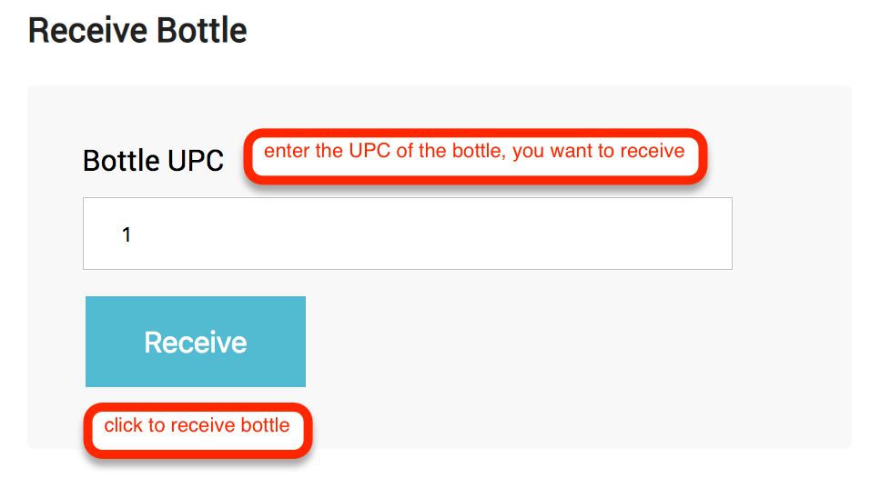
## Diagrams
### Activity Diagram

### Sequence Diagram

### State Diagram

### Class Diagram

## Libraries
### Truffle and Ganache
Truffle provides the ability to compile and deploy the contract to the
target network.

Ganache provides ability to run the test Etherium network locally, so it is
much easier to test the contract and it's front-end during the development.

### Metamask
Metamask provides ability to interact the contract deployed to any network using the
browser plugin.
### Express
Express provides the ability to serve the contract front-end to the 
end-user browser.

